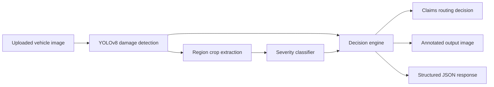

# AI-Powered Vehicle Damage Assessment for Auto Insurance Claims

This project simulates an insurance claims automation workflow that evaluates a photo of a damaged vehicle, identifies likely damage regions, assigns a severity label, and routes the claim either into straight-through processing or human adjuster review. The emphasis is on production-style pipeline design, clean separation of business logic from model code, and a demoable end-to-end flow rather than inflated model claims.

## Problem framing

Auto insurers increasingly try to reduce claim cycle time by auto-approving simple, low-risk repairs while routing ambiguous or high-severity cases to adjusters. This project models that triage step:

- ingest a vehicle image
- detect visible damage regions
- classify each region as `Minor`, `Moderate`, or `Severe`
- apply transparent business rules
- return JSON output plus an annotated image

## Architecture



## Project structure

```text
vehicle-damage-assessment/
├── api/
│   └── main.py
├── app/
│   └── streamlit_app.py
├── data/
│   ├── README.md
│   └── download_dataset.py
├── models/
│   ├── train_classifier.py
│   ├── train_detector.py
│   └── weights/
│       └── .gitkeep
├── notebooks/
│   └── .gitkeep
├── src/
│   ├── __init__.py
│   ├── decision_engine.py
│   ├── detection.py
│   ├── pipeline.py
│   └── severity.py
├── tests/
│   └── test_decision_engine.py
├── .gitignore
├── Dockerfile
├── docker-compose.yml
├── requirements.txt
└── README.md
```

## How it works

### Stage 1: Damage detection

`src/detection.py` loads a YOLOv8 detector when trained weights are available. In this workspace, no trained detector weights are present, so the module falls back to a deterministic mock detector that generates a plausible region from image texture variance. That keeps the pipeline executable without inventing metrics or pretending a model was trained.

### Stage 2: Severity classification

`src/severity.py` is a separate, swappable module. It loads a ResNet18-based classifier when weights are present; otherwise it applies a deterministic image-statistics fallback to assign `Minor`, `Moderate`, or `Severe`.

### Stage 3: Decision engine

`src/decision_engine.py` contains the routing rules:

- all `Minor` and 1-2 regions: `Straight-Through Eligible`
- any `Severe`: `Needs Adjuster Review`
- 3 or more regions: `Needs Adjuster Review`
- any `Moderate`: `Needs Adjuster Review`

This logic is intentionally isolated from the ML layer so it can be tested and explained independently.

## Running locally

### API

```bash
python3 -m venv .venv
source .venv/bin/activate
pip install -r requirements.txt
uvicorn api.main:app --reload
```

API docs are available at [http://127.0.0.1:8000/docs](http://127.0.0.1:8000/docs).

### Streamlit demo

In a second terminal, with the same environment active:

```bash
streamlit run app/streamlit_app.py
```

The demo app expects the API at `http://127.0.0.1:8000/predict`.

### Docker

```bash
docker-compose up --build
```

This starts:

- FastAPI on `http://127.0.0.1:8000`
- Streamlit on `http://127.0.0.1:8501`

## API response shape

`POST /predict` accepts a multipart image upload and returns JSON in this shape:

```json
{
  "damage_detections": [
    {
      "type": "scratch",
      "location": "front_center",
      "bbox": [48, 76, 220, 148],
      "severity": "Minor",
      "confidence": 0.72,
      "estimated_cost_range": "$200-$500"
    }
  ],
  "overall_severity": "Minor",
  "estimated_cost_range": "$200-$500",
  "estimate_note": "Illustrative rule-based estimate only, not a real actuarial or repair-platform quote.",
  "routing_decision": "Straight-Through Eligible",
  "reasoning": "One or two minor regions detected with no severe indicators.",
  "processing_mode": "mock",
  "annotated_image_base64": "..."
}
```

## Training scaffolds

- `data/download_dataset.py` can register a local YOLO-format dataset or download a Roboflow YOLOv8 export when `ROBOFLOW_API_KEY` is available
- `models/train_detector.py` trains a YOLOv8 detector from `data/dataset.yaml`
- `data/prepare_severity_dataset.py` converts labeled damage boxes into `ImageFolder` crops for severity training
- `models/train_classifier.py` trains a ResNet18 severity classifier and saves `models/weights/severity.pth`

No accuracy, mAP, or production-quality evaluation numbers are claimed here. Model metrics are `TBD after training`.

## Dataset-backed training flow

### Option 1: Register a local YOLO dataset

If you already have a YOLO-format damage dataset with `train`, `valid`, and optional `test` folders:

```bash
python3 data/download_dataset.py \
  --source local \
  --local-dir /absolute/path/to/your/yolo-dataset
```

This copies the dataset under `data/raw/`, writes `data/dataset.yaml`, and records metadata in `data/dataset_metadata.json`.

### Option 2: Download from Roboflow

If you have a Roboflow project and API key:

```bash
export ROBOFLOW_API_KEY=your_key_here
python3 data/download_dataset.py \
  --task detection \
  --source roboflow \
  --workspace capstone-nh0nc \
  --project car-damage-detection-t0g92 \
  --version 4
```

The script requests a YOLOv8 export, stores it under `data/raw/`, and writes a normalized `data/dataset.yaml`.

The prompt’s primary detection dataset is the CAPSTONE Roboflow Universe project:

- dataset: `Car Damage Detection`
- workspace: `capstone-nh0nc`
- project: `car-damage-detection-t0g92`
- verified on July 13, 2026: the public Universe page listed `3,226` images, `4` dataset versions, and `CC BY 4.0` license

The current downloader uses the Roboflow Python SDK with `ROBOFLOW_API_KEY` from the environment rather than hardcoding credentials.

### Train the detector

```bash
python3 models/train_detector.py \
  --data data/dataset.yaml \
  --model yolov8n.pt \
  --epochs 50 \
  --imgsz 640
```

Typical trained weights will land under `models/runs/detector/weights/`.

### Prepare severity training crops

The severity classifier expects normalized `ImageFolder` classes arranged as:

```text
data/severity/
├── Minor/
├── Moderate/
└── Severe/
```

If you have severity labels in CSV form, prepare the crop dataset with:

```bash
python3 data/prepare_severity_dataset.py \
  --images-dir /absolute/path/to/images \
  --labels-csv /absolute/path/to/severity_labels.csv
```

Expected CSV columns:

- `image_name`
- `x1`
- `y1`
- `x2`
- `y2`
- `severity`

If you want to start from the Roboflow Universe severity dataset mentioned in the prompt instead, the downloader can normalize its class labels into `Minor` / `Moderate` / `Severe` automatically:

```bash
export ROBOFLOW_API_KEY=your_key_here
python3 data/download_dataset.py \
  --task severity \
  --source roboflow \
  --workspace car-damage-severity \
  --project vehicle-damage-severity \
  --version 3
```

Verified on July 13, 2026, the public Universe page for `vehicle-damage-severity` listed `517` images, `3` dataset versions, and `CC BY 4.0` license. The published classes are not already in the target severity schema, so the project writes `data/severity_mapping.json` to explicitly bucket those labels into the decision engine’s `Minor` / `Moderate` / `Severe` scheme.

### Train the severity classifier

```bash
python3 models/train_classifier.py \
  --data-dir data/severity \
  --epochs 10 \
  --batch-size 16 \
  --output models/weights/severity.pth
```

After training:

- copy detector weights to `models/weights/detector.pt` if you want the API to auto-load them
- keep classifier weights at `models/weights/severity.pth`

## Reproducibility note

This repository does not claim that the referenced public datasets were downloaded or trained successfully in this session. The exact Roboflow project slugs, version numbers, and the verification date above are recorded so you can reproduce the same starting point once credentials are available.

## Testing

```bash
pytest tests/test_decision_engine.py
```

The unit tests cover business-routing logic independently from trained model availability.

## Limitations & Path to Production

This implementation is structured as a portfolio-grade claims-triage prototype, not a carrier-ready deployment. No trained weights or carrier-provided claims dataset are included in this workspace, so the executable default path uses deterministic fallback logic rather than a validated production model. If a public dataset is later attached, it should be described explicitly in terms of source, license, class coverage, and actual sample counts before any model claims are made.

Any future training run should also be treated with appropriate caution. A small public vehicle-damage dataset is unlikely to reflect the operational diversity of real insurance intake images, including lighting variation, camera quality, framing inconsistency, vehicle mix, aftermarket parts, weather conditions, and partial occlusion. Class balance and annotation consistency would need to be audited rather than assumed.

The cost output is intentionally illustrative. The current estimate bands are rule-based lookup values that make the decision output easier to interpret during a demo, but they are not derived from real repair-cost data. A production system would integrate with established estimating platforms such as Mitchell, CCC, or Audatex instead of relying on static tables.

The model design is also intentionally simplified. There is no formal out-of-distribution evaluation in this workspace, and the current flow does not explicitly guard against multi-vehicle scenes, non-vehicle uploads, or heavily obscured damage. The severity classifier is limited to a 3-class scheme, while real claims triage often benefits from finer-grained scoring and downstream calibration against business costs.

Production readiness would require:

- a larger carrier-sourced labeled dataset with adjuster-reviewed ground truth
- integration with a real repair-estimating data source
- human-in-the-loop thresholds calibrated against real false-positive and false-negative cost tradeoffs
- compliance-grade audit logging and decision traceability
- controlled A/B validation against actual adjuster outcomes before enabling any live auto-approval path
