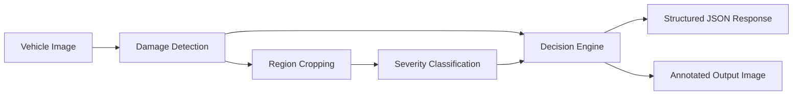

# AI-Powered Vehicle Damage Assessment for Auto Insurance Claims

Backend-focused implementation of a claims-triage pipeline for vehicle damage images. This version intentionally excludes the frontend demo layer and focuses on the API, pipeline orchestration, decision engine, training scaffolds, and tests.

## What it does

The system accepts an image, detects likely damage regions, assigns a severity to each region, and returns a structured claims-routing result:

- `Straight-Through Eligible` for low-complexity cases
- `Needs Adjuster Review` for moderate or severe cases

The project is designed to remain demoable even when no trained model weights are present. In that case, it falls back to deterministic mock predictions and clearly labels the result as such.

## Architecture



## Project structure

```text
vehicle-damage-assessment/
├── api/
│   └── main.py
├── data/
│   ├── README.md
│   └── download_dataset.py
├── models/
│   ├── train_classifier.py
│   ├── train_detector.py
│   └── weights/
│       └── .gitkeep
├── src/
│   ├── __init__.py
│   ├── decision_engine.py
│   ├── detection.py
│   ├── pipeline.py
│   └── severity.py
├── tests/
│   └── test_decision_engine.py
├── .gitignore
├── docker-compose.yml
├── Dockerfile
├── requirements.txt
└── README.md
```

## Running locally

```bash
python -m venv .venv
source .venv/bin/activate
pip install -r requirements.txt
uvicorn api.main:app --reload
```

The API will be available at `http://127.0.0.1:8000`.

## API usage

`POST /predict`

Form field:

- `file`: image upload

Example response:

```json
{
  "damage_detections": [
    {
      "type": "scratch",
      "bbox": [48, 76, 220, 148],
      "severity": "Minor",
      "confidence": 0.72,
      "estimated_cost_range": "$200-$500"
    }
  ],
  "overall_severity": "Minor",
  "routing_decision": "Straight-Through Eligible",
  "estimated_cost_range": "$200-$500",
  "reasoning": "One or two minor regions detected with no severe indicators.",
  "processing_mode": "mock",
  "annotated_image_base64": "..."
}
```

## Training notes

- `models/train_detector.py` contains a YOLOv8 training scaffold.
- `models/train_classifier.py` contains a torchvision transfer-learning scaffold for severity classification.
- `data/download_dataset.py` documents a reproducible dataset prep flow, but does not fabricate downloads or metrics when network access is unavailable.

## Testing

```bash
pytest tests/test_decision_engine.py
```

## Limitations

- No trained weights are included in this workspace.
- Damage cost ranges are rule-based illustrative estimates, not actuarial outputs.
- Fraud detection, part pricing, and repairability analysis are out of scope.
- Detection and severity inference fall back to mock behavior until real models are trained and loaded.
